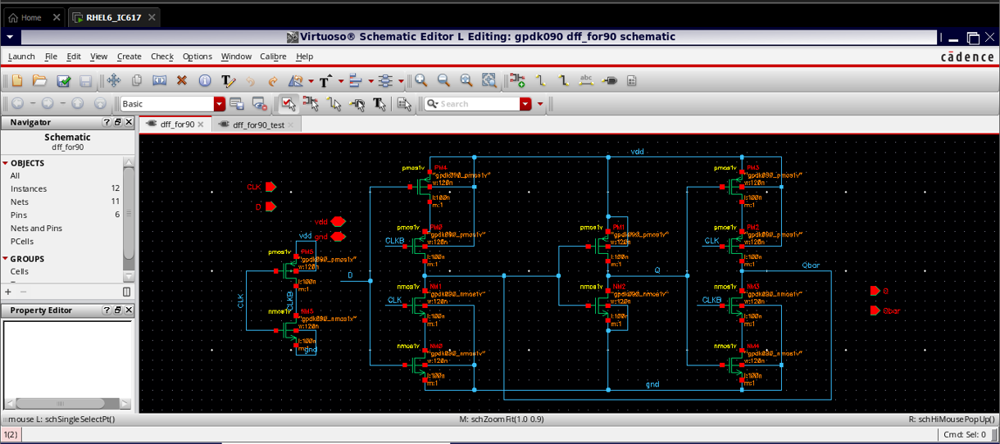
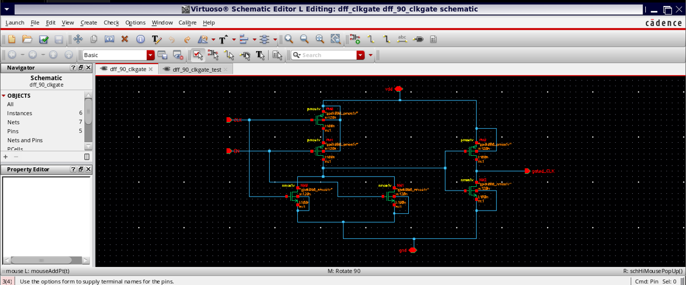
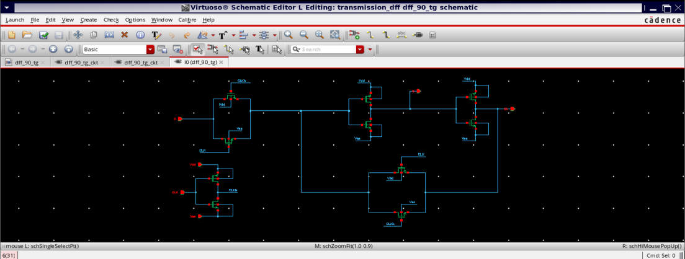
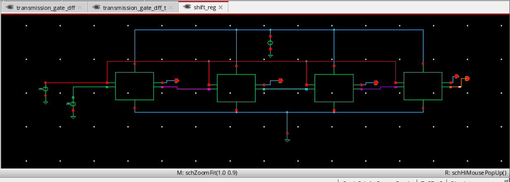

# Low-Power Clock-Gated and Transmission-Gate Flip-Flop Design

## Overview

This project presents a transistor-level design and comparative analysis of low-power D Flip-Flop (DFF) architectures implemented using:

- Conventional CMOS topology  
- OR-based clock gating  
- Transmission-gate (TG) latch structures  
- Multi-technology node evaluation (90 nm & 45 nm)  
- FPGA functional validation (Intel Cyclone IV & Cyclone V)  

The objective is to analyze power-delay trade-offs and evaluate energy efficiency across technology scaling and practical hardware implementation.

---

## Motivation

In modern synchronous digital systems, clock networks and flip-flops account for a significant portion (≈30–50%) of total dynamic power consumption.

Traditional DFFs toggle internal nodes every clock cycle — even when input data remains unchanged — leading to unnecessary switching activity and dynamic power waste.

This work investigates:

- Clock gating to suppress redundant clock transitions  
- Transmission-gate logic to reduce short-circuit current  
- Hybrid TG + clock-gating architecture for improved energy efficiency  

---

## Design Implementations (Cadence – 90 nm CMOS)

### 1. Conventional CMOS D Flip-Flop

Baseline master–slave CMOS implementation used as reference for comparison.

---

### 2. Clock-Gated D Flip-Flop

Introduces OR-gated clock control using an enable signal to suppress unnecessary switching during idle cycles.

---

### 3. Transmission-Gate Clock-Gated D Flip-Flop

Combines:

- OR-gated clock gating  
- Transmission-gate latch pair  

This hybrid structure minimizes internal switching activity and short-circuit current while maintaining full voltage swing.

---

### 4. 4-bit Serial-In Parallel-Out (SIPO) Shift Register

Demonstrates scalability of the proposed flip-flop architecture in sequential systems.

---

## Cadence CMOS Implementation Details

- **Tool:** Cadence Virtuoso (ADE)  
- **Supply Voltage:** 1 V  
- **Clock Frequency:** 100 MHz  
- **Technology Nodes:** 90 nm & 45 nm  
- **Measurement Metrics:**  
  - Average Dynamic Power  
  - Propagation Delay (CLK → Q)  
  - Power-Delay Product (PDP)  

All designs were implemented using explicit PMOS and NMOS transistor-level schematics.

---

## Performance Summary

### 🔹 90 nm Technology

| Design | Power (nW) | Delay (ns) | PDP (fJ) |
|--------|------------|------------|----------|
| Conventional DFF | 250.6 | 40.04 | ~10040 |
| Clock-Gated DFF | 278.7 | 52.41 | ~14600 |
| TG-Clock-Gated DFF | 145.8 | 60.04 | ~8750 |

**Key Insight:**  
TG-based clock-gated DFF achieves ~41% power reduction compared to the conventional design and provides the lowest energy per switching event.

---

### 🔹 45 nm Technology

| Design | Power (nW) | Delay | PDP (fJ) |
|--------|------------|-------|----------|
| Conventional DFF | 61.92 | 58.83 ps | ~3.64 |
| Clock-Gated DFF | 79.29 | 66.27 ps | ~5.25 |
| TG-Clock-Gated DFF | 39.03 | 65.82 ps | ~2.57 |

**Key Insight:**  
Technology scaling significantly reduces both dynamic power and delay.  
TG-based architecture consistently delivers the best energy efficiency across nodes.

---

## Power-Delay Trade-Off Analysis

- Clock gating alone reduces unnecessary switching but introduces minor delay overhead.
- Transmission-gate integration reduces short-circuit current and internal node toggling.
- Combined TG + clock gating architecture achieves optimal Power-Delay Product (PDP).
- Scaling from 90 nm to 45 nm improves both performance and energy efficiency.

---

## FPGA Validation

RTL behavioral models of all architectures were synthesized using Intel Quartus Prime.

**Target Devices:**
- Cyclone IV (60 nm)
- Cyclone V (28 nm)

**Clock Frequency:** 100 MHz  
**Power Estimation:** Quartus Power Analyzer using switching activity (.vcd)

---

### Cyclone IV Power Results

| Design | Total Thermal Power (mW) |
|--------|--------------------------|
| Conventional DFF | 59.25 |
| Clock-Gated DFF | 59.01 |
| TG-Based DFF | 58.76 |
| 4-bit SIPO | 60.15 |

---

### Cyclone V Power Results

| Design | Total Thermal Power (mW) |
|--------|--------------------------|
| Conventional DFF | 419.56 |
| Clock-Gated DFF | 419.51 |
| TG-Based DFF | 419.44 |
| 4-bit SIPO | 419.80 |

---

### FPGA Observations

- TG-based architecture shows consistently lowest estimated power.
- Relative power reduction trend matches Cadence transistor-level results.
- Absolute power differs due to FPGA fabric architecture and routing complexity.
- FPGA implementation validates functional scalability and switching reduction trends.

**Note:**  
Transmission-gate benefits are physically validated at transistor level in Cadence.  
FPGA implementation models behavioral switching characteristics only.

---

## Project Structure
- rtl/ → Verilog RTL implementations
- tb/ → Testbenches
- docs/ → Detailed Cadence and FPGA analysis
- results/ → Power and delay reports
- images/ → Schematics and waveform screenshots

---

## Key Engineering Takeaways

- Transmission-gate logic significantly reduces internal node transitions.
- Clock gating suppresses redundant clock activity during idle periods.
- TG-based clock-gated DFF achieves best energy efficiency across scaling.
- Power-saving trends remain consistent across both CMOS and FPGA domains.
- Architectural optimization at transistor level remains effective under technology scaling.

---

## Conclusion

This project demonstrates that combining transmission-gate logic with clock gating provides a balanced trade-off between power efficiency and propagation delay.

Multi-node CMOS analysis and FPGA validation confirm that the proposed architecture is suitable for low-power, high-performance VLSI systems.
